# Cornac-AB

**Cornac-AB** is an open-source solution for A/B testing with integration from the **Cornac** framework.

This tool provides you a solution to let you experiment with different recommendation models, visualize A/B test results, and analyze user interactions.

## Key Features
| User Interaction Solution | Recommendations Dashboard | Feedback Dashboard |
|:------------------------:|:------------------------:|:------------------:|
| 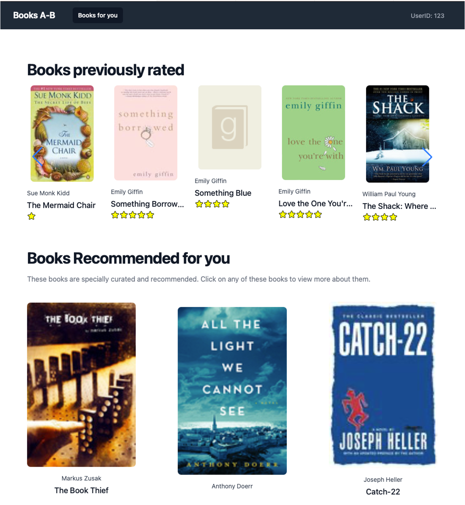 | 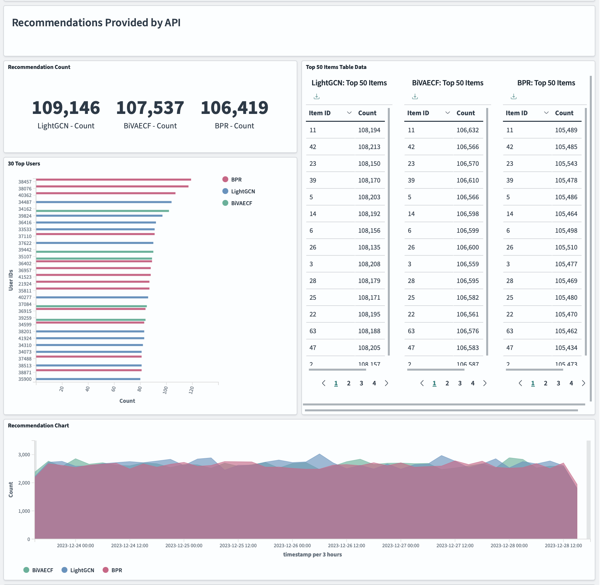 | 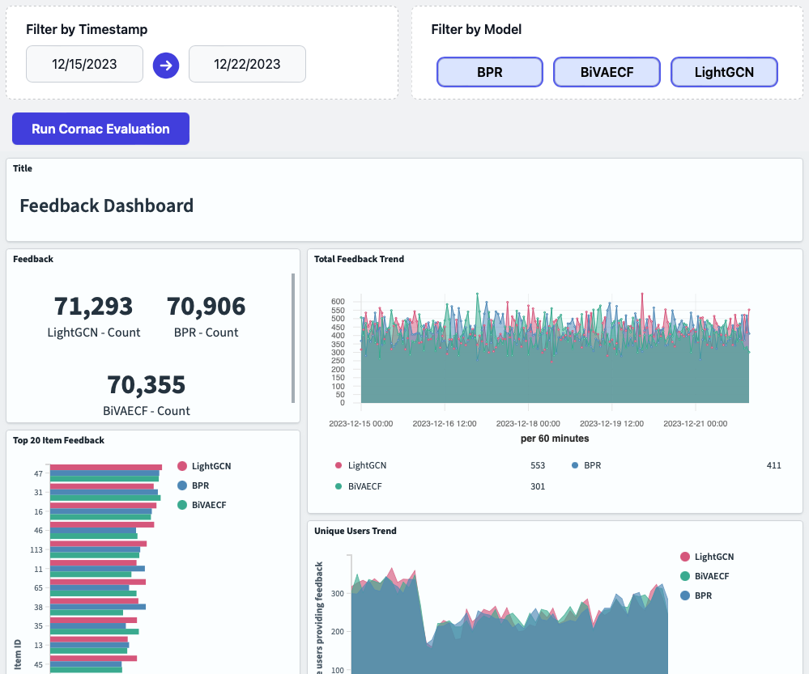 |

- **OpenSearch Integration**: Provides robust data indexing, retrieval, and visualization.
- **Easy Experiment Setup**: Effortlessly create A/B tests and collect user feedback, leveraging Cornac’s comprehensive evaluation mechanisms.
- **Interactive Dashboards**: Analyze model behavior, user interactions, and A/B test outcomes with visually rich dashboards.

## What is Cornac?
**[Cornac](https://github.com/preferredAI/cornac)** is an open-source Python library designed for multimodal recommender systems. 

It offers a wide variety of models for collaborative filtering, content-based, explainable, and next-item or next-basket recommendation.

Cornac is endorsed by ACM RecSys for evaluating and reproducing recommendation algorithms.

## Architecture Overview

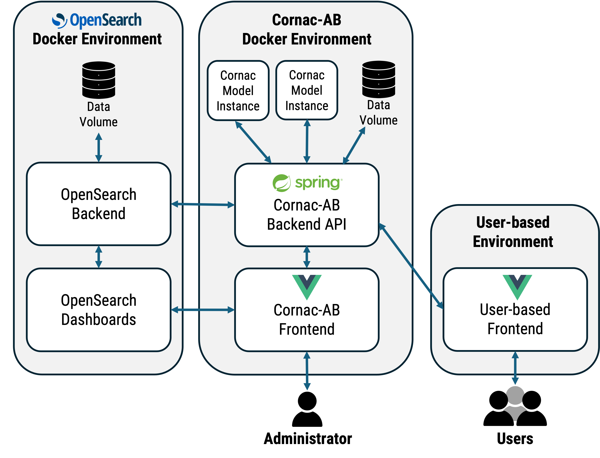

The architecture consists of the following components:

1. **Cornac-AB Backend Server** ([Backend source code](backend)): Handles API endpoints and business logic.
2. **Books-AB User Interaction Frontend** ([User Interaction Frontend source code](democlient)): Provides a frontend for user interactions.
3. **Cornac-AB Frontend** ([Frontend source code](frontend)): Offers a user interface to setup, track and evaluate models for the A/B tests.
4. **OpenSearch & OpenSearch Dashboards** ([Official site](https://opensearch.org)): Data indexing, search, and visualization.
5. **GoodReads 10k Dataset** ([Goodbooks-10k repository](https://github.com/zygmuntz/goodbooks-10k)): Preloaded data for demonstration purposes.

## Quick Start

To get started with Cornac-AB, you need [Docker](https://www.docker.com/products/docker-desktop/). After installing Docker, run the following command to set up the solution:
```bash
docker compose up
```
This command will start all the required components and load the GoodReads dataset into OpenSearch for A/B testing and visualization.

## Usage Guide

### Accessing the Solution

Once the containers are running, you can access the various parts of the solution via the following URLs:
- [Books-AB User Interaction Frontend](#2) `localhost:8082`
- [Cornac-AB Frontend]() `localhost:8081`
- OpenSearch API `localhost:9200`
- OpenSearch Dashboards `localhost:5601`

### 1. Cornac-AB Backend

This backend server is built on [Spring](https://spring.io/). Spring is a production grade scalable framework for building web applications.

This solution connects to a local h2 database (which could be easily replaceable with most SQL databases supported by Spring).

[Cornac instances](https://cornac.readthedocs.io/en/stable/user/iamadeveloper.html#running-an-api-service) (Based on Flask) are run on this container, and restarts automatically should it be found to be down.

The [Spring Data OpenSearch](https://github.com/opensearch-project/spring-data-opensearch) library has been used to connect the backend to the OpenSearch service.

### 2. Books-AB User Interaction Frontend

#### Accessing the frontend
http://localhost:8082/

Included in this solution is a sample frontend that showcases how the solution receives user interactions.

#### A. Selecting a User ID

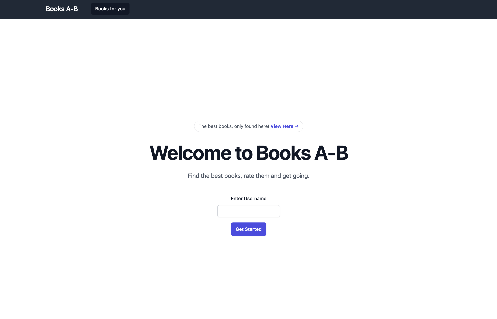 

Users will first enter their User ID. To decrease the size of the sample data, we only included past book history data of user IDs 100-199.

#### B. Viewing Books Recommendations
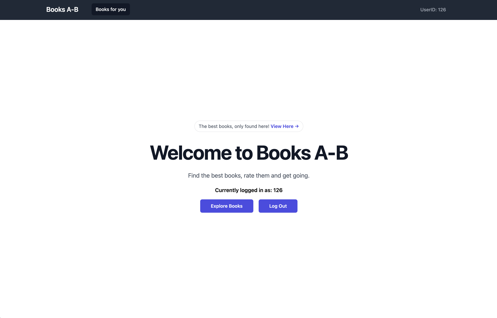 

Click **Explore Books**. A particular model is allocated by the backend, which provides recommendations as on this explore page. Recommendation records are stored in OpenSearch as well. 

#### C. Providing Book Feedback
Users could select to view more details by clicking on them.

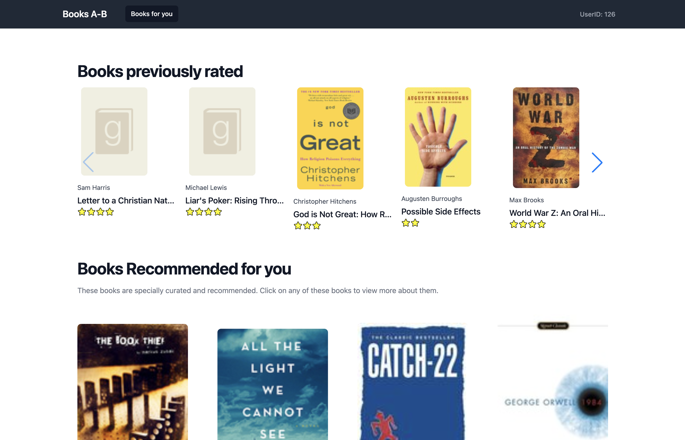 

When a user clicks on a book, we register that as a feedback. This feedback will be attributed with the **click** action on OpenSearch.

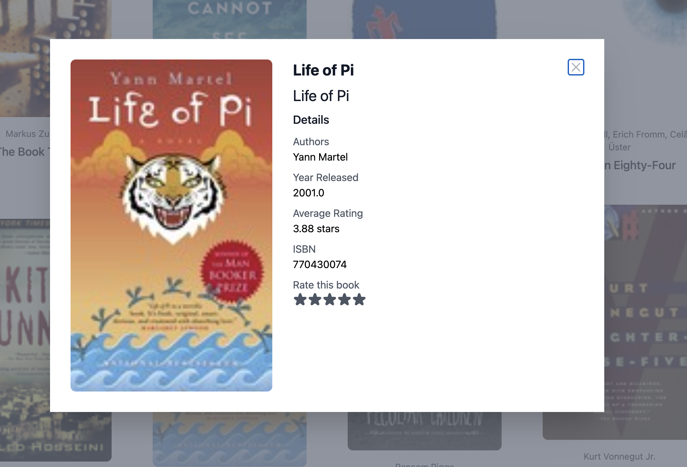  

Further in this view, users will be able to rate the book by click the stars icon, which will be attributed with a **rate** action as a feedback on OpenSearch.

#### D. Viewing User Interactions


User interaction in this frontend will be recorded in OpenSearch as **recommendations** and **feedbacks**. These can be viewed in the Cornac-AB frontend dashboards in real-time, as shown in the next section.

#### 3. Cornac-AB Frontend

#### Accessing the frontend
http://localhost:8081/

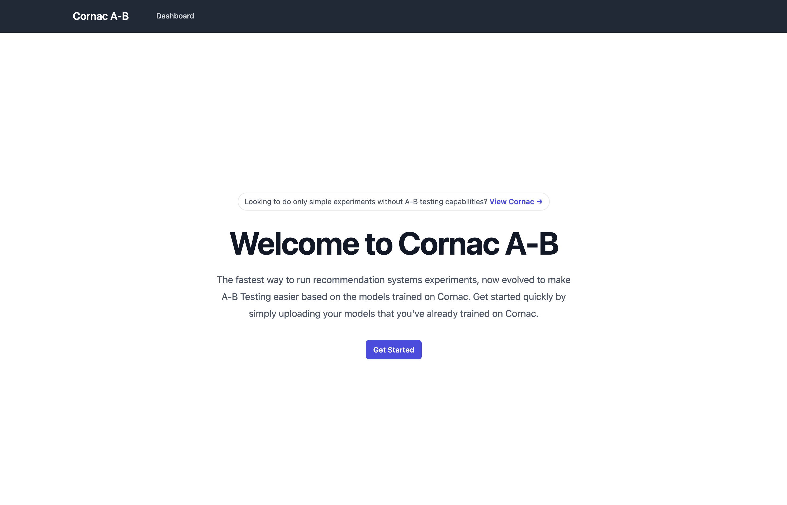 

You'll be welcomed with this screen.

#### A. Viewing the Dashboards

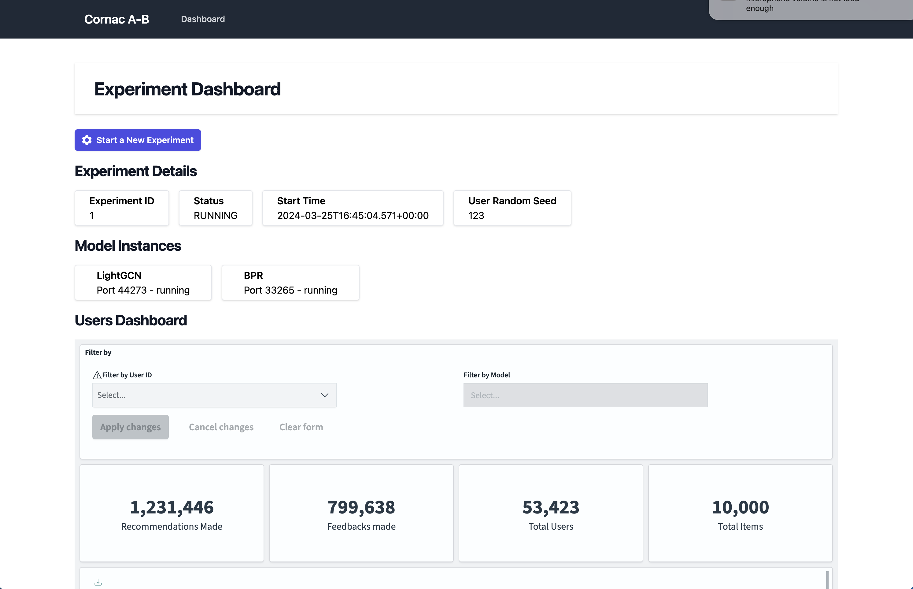

Going to the dashboard screen will show you multiple dashboards, including the Users, Recommendations and Feedback dashboards. Sample data based on the Goodbooks 10k dataset has already been generated and inserted for you.

#### B. Evaluating your Models
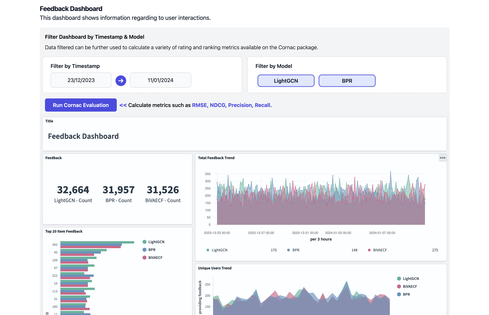

Under the Feedback Dashboard section, you will be able to filter data, and further compare your models using the Cornac evaluation features by selecting the **Run Cornac Evaluation** button.

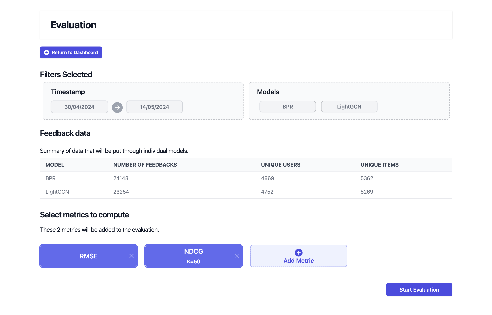

A summary of the data that will be put through Cornac's evaluation services will be shown. You could add more metrics by selecting the **Add Metric** button will allow you to add more metrics as shown below.

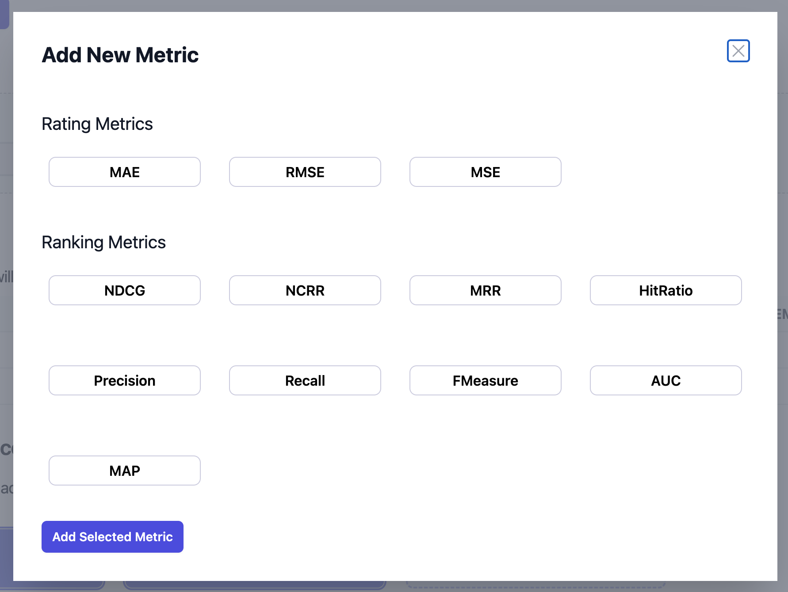

#### C. Viewing Evaluation Results

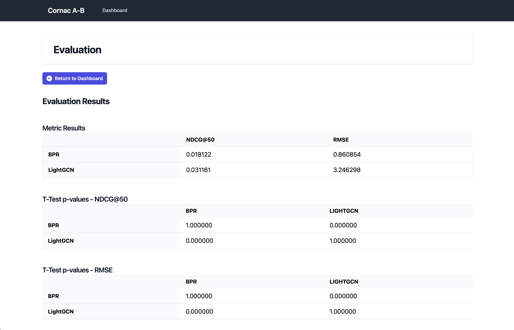

You will then be shown with the metric results, along with the p-values of individual models to evaluate the performance of your models.

## Further Usage

Cornac-AB is a solution which showcases how A/B Testing could be done and visualized as a forward testing experiment. Feel free to further contribute, or fork the repository and extend it to your own application needs.

## Contributing

This project welcomes contributions and suggestions. Before contributing, please see our [contribution guidelines](https://cornac.readthedocs.io/en/stable/developer/index.html).

## Citation

If you use Cornac in a scientific publication, we would appreciate citations to the following papers:

<details>
  <summary><a href="https://ieeexplore.ieee.org/abstract/document/9354572">Cornac-AB: An Open-Source Recommendation Framework with Native A/B Testing Integration</a>, Ong <i>et al.</i>, In Proceedings of the ACM Web Conference 2024.</summary>

  ```
  @inproceedings{ong2024cornacab,
    title={Cornac-AB: An Open-Source Recommendation Framework with Native A/B Testing Integration},
    author={Ong, Darryl and Truong, Quoc-Tuan and Lauw, Hady W},
    journal={Proceedings of the ACM Web Conference 2024},
    pages={xx--yy},
    year={2024}
  }
  ```
</details>

<details>
  <summary><a href="http://jmlr.org/papers/v21/19-805.html">Cornac: A Comparative Framework for Multimodal Recommender Systems</a>, Salah <i>et al.</i>, Journal of Machine Learning Research, 21(95):1–5, 2020.</summary>

  ```
  @article{salah2020cornac,
    title={Cornac: A Comparative Framework for Multimodal Recommender Systems},
    author={Salah, Aghiles and Truong, Quoc-Tuan and Lauw, Hady W},
    journal={Journal of Machine Learning Research},
    volume={21},
    number={95},
    pages={1--5},
    year={2020}
  }
  ```
</details>

## License

[Apache License 2.0](LICENSE)
